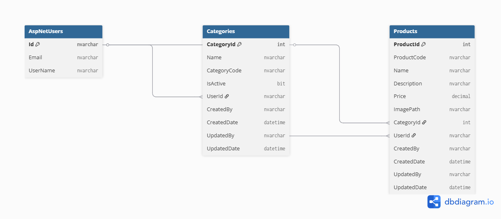

# Product Management System

A full-stack Product Management application developed using **ASP.NET Core MVC**, **ASP.NET Core Web API**, **Entity Framework Core**, and **SQL Server**.

This system allows authenticated users to securely manage their own categories and products with support for Excel import/export, image uploads, auditing, and API endpoints.

---

# Project Highlights

✅ Secure user authentication using ASP.NET Core Identity  
✅ Per-user data isolation (users only manage their own records)  
✅ Category & Product CRUD operations  
✅ Unique category codes with validation rules  
✅ Auto-generated product codes  
✅ Product image upload  
✅ Excel import/export using EPPlus  
✅ Pagination  
✅ Audit trail fields  
✅ Swagger API documentation  
✅ Layered architecture (Controller / Service / Repository)

---

# Technology Stack

## Backend
- C#
- ASP.NET Core (.NET 8)
- ASP.NET Core MVC
- ASP.NET Core Web API
- Entity Framework Core

## Frontend
- Razor Views
- Bootstrap 5

## Database
- SQL Server

## Additional Libraries
- ASP.NET Core Identity
- EPPlus (Excel Import/Export)
- Swashbuckle (Swagger)

---

# Core Features

# Authentication
- User Registration
- Login / Logout
- Identity-based security

# Category Management
- Create categories
- Edit categories
- Unique category code validation
- Example format: `ABC123`

# Product Management
- Create products
- Edit products
- Delete products
- Product image upload
- Automatic product code generation

# Excel Integration
- Upload products via Excel
- Download products as Excel spreadsheet

# Auditing
Tracks:

- CreatedBy
- CreatedDate
- UpdatedBy
- UpdatedDate

# API Endpoints

Swagger UI available at:

```text
/swagger
```
Includes:

- Products API
- Categories API

# Security

Each authenticated user can only access their own:

- Categories
- Products

Data ownership is enforced using the logged-in user's Identity UserId.

# Architecture
Controllers
   ↓
Services
   ↓
Repositories
   ↓
Entity Framework Core
   ↓
SQL Server

# Entity Relationship Diagram



# Setup Instructions

## Requirements

- Visual Studio 2022
- SQL Server / SQL Server Express / LocalDB
.- NET 8 SDK

## Run Steps

1. Clone repository

```
git clone <repo-url>
```
2. Open solution in Visual Studio
3. Update connection string in:
```
appsettings.json
```
4. Apply database migrations

```
Update-Database
```
5. Run application
6. Register a new user account
7. Login and start managing products

# Future Improvements

- JWT Authentication
- Dashboard Analytics
- Unit Testing
- Soft Delete
- Docker Deployment
- Cloud Hosting (Azure)

